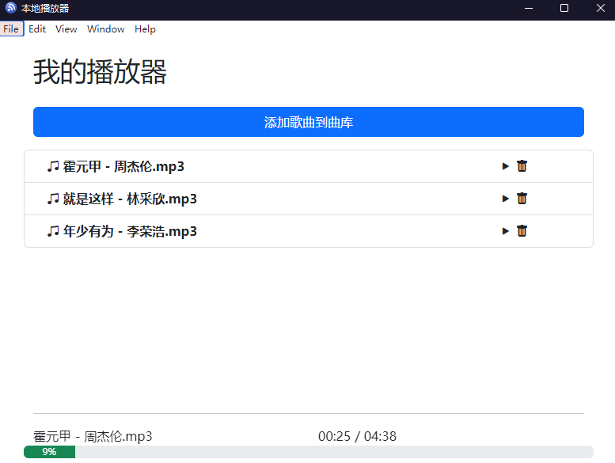
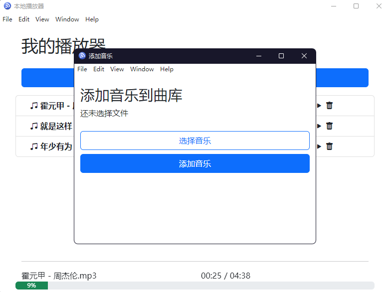

# electron 本地音乐播放器

## 简单的使用 electron 做了个 demo

## 主要是播放，添加音乐和本地存储

## 一、技术栈

该项目主要使用 `electron`搭配`bootstrap`采用组件化的方式开发完成,此外项目中陆续使用有

- bootstrap-icons
- electron-store
- uuid
- electron-builder
- electron-packager

## 二、运行效果截图

#### 1 首页

#### 2 添加音乐页

